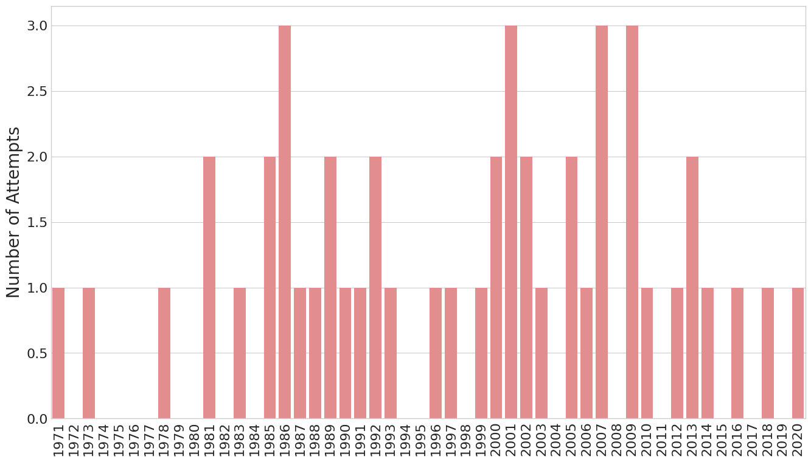

# Helicopter Escapes - Lists and simple loops

I recently started the DataQuest *Data Science in Python* path. Even though I've been using Python for a number of years, I started at the beginning. I just completed the first project looking at Helicopter Escapes. It's been going quickly, but I have been reminded of a few best-practices.

You can find the full project on my [GitHub here](https://github.com/joshfuchs/DataScience_projects/blob/master/Prison_Break_project.ipynb), or read below for some highlights. 

We loaded the data directly from Wikipedia from the [List of helicopter prison escapes](https://en.wikipedia.org/wiki/List_of_helicopter_prison_escapes). We simply called the data `data`, which is just a list.

There were six columns in `data`

| Date | Prison Location | Country | Successful? | Names of escapee(s) | Description |
|------|-----------------|---------|-------------|---------------------|-------------|

We didn't care about the `description` so we removed it at this point:

```
index = 0
for row in data:
    data[index] = row[:-1]
    index += 1
```

We next wanted to look at attempts per year, so we used a lambda function to find the min and max year
```
min_year = min(data, key=lambda x: x[0])[0]
max_year = max(data, key=lambda x: x[0])[0]
```

Finally, we can loop through our `data` to compile the number of attempts per year. I won't include it here, but `attempts_per_year` is a list of lists that was initialized with two elements: the years and 0. (i.e. [1971,0]).

```
for row in data:
    for ya in attempts_per_year: 
        y = ya[0]
        if row[0] == y:
            ya[1] += 1
```    

DataQuest had a built-in function to plot a simple bar plot of this. I found it hard to read. So I plotted the data in *Seaborn* instead. I have recently started using *Seaborn* frequently and like how intuitive and customizable it is. 



I was also curious how many of these were successful, as a fraction of the number of attempts that year.


These are small number of statistics, especially since the largest number of attempts in a single year was 3. But we don't see an obviously significant change in how successful these attempts were.
